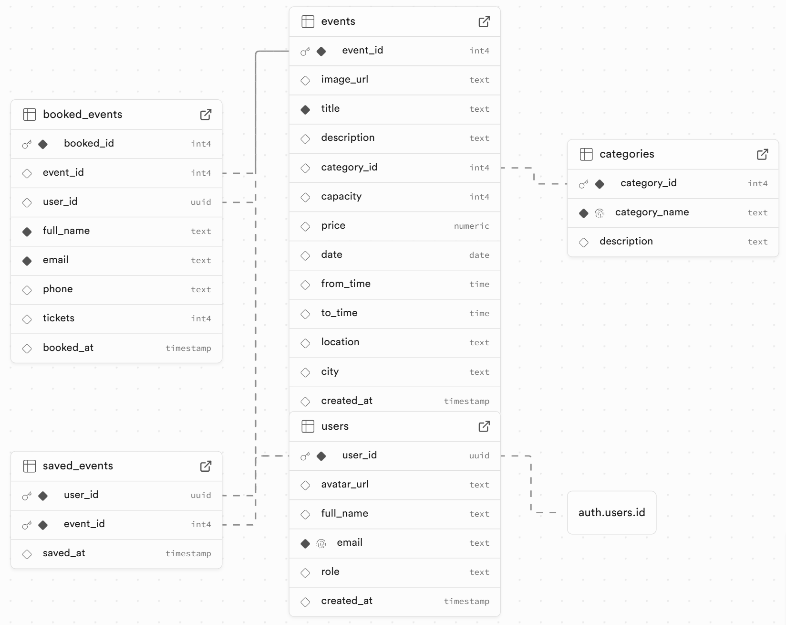

<p align="center"> <a href="https://git.io/typing-svg">  </a> </p>

# 🗂️ EventHub Backend API

This repo is the EventHub backend API — a RESTful service that powers the EventHub frontend. It provides endpoints for browsing events, creating events (admin/staff), booking events, saving events, user admin (roles), and sending confirmation emails.

💻 Frontend Repository: [View Frontend Repo](https://github.com/PhoneSettPaing/Events-Platform-Frontend)
<br/>

## 📖 Table of Contents

- [🗂️ EventHub Backend API](#️-eventhub-backend-api)
  - [📖 Table of Contents](#-table-of-contents)
  - [🚀 Live Demo](#-live-demo)
  - [✨ Features](#-features)
  - [🛠️ Tech Stack](#️-tech-stack)
  - [📦 Architecture](#-architecture)
  - [🗄️ Database Schema](#️-database-schema)
  - [✅ Getting started](#-getting-started)
    - [🔧 Prerequisites](#-prerequisites)
    - [🛠 Installation \& Setup](#-installation--setup)
  - [🧪 Running Tests](#-running-tests)
  - [📖 API Documentation](#-api-documentation)
    - [🔑 Core API Endpoints](#-core-api-endpoints)
  - [🔮 Future work](#-future-work)
  - [👤 Credits](#-credits)

<br/>

## 🚀 Live Demo

👉 [Access the Live API on Render](https://events-platform-2oil.onrender.com/api/)

👉 [Frontend: EventHub Web App](https://eventhub-events.netlify.app/)

<br/>

## ✨ Features

- 🌐 Public endpoints — browse all available events and categories
- 🎟️ Book events — users can reserve tickets and view their booked events
- 💾 Save/unsave events — save events for later in a personal list
- 🧑‍💼 Admin controls — view users, update roles (user / staff)
- 📝 Staff/Admin tools — create events
- 📧 Email confirmations — automated booking emails sent via Resend
- 🧱 Well-structured API — clean architecture, tested, and deployed on Render

<br/>

## 🛠️ Tech Stack

<p align="left"> <a href="https://github.com/alexandresanlim/Badges4-README.md-Profile" ></a> <a href="https://github.com/alexandresanlim/Badges4-README.md-Profile" ></a> <a href="https://github.com/alexandresanlim/Badges4-README.md-Profile" ></a> <a href="https://badges.pages.dev/" ></a> <a href="https://github.com/alexandresanlim/Badges4-README.md-Profile" ></a> <a href="https://github.com/alexandresanlim/Badges4-README.md-Profile" ></a> <a href="https://github.com/alexandresanlim/Badges4-README.md-Profile" ></a> <a href="https://github.com/alexandresanlim/Badges4-README.md-Profile" ></a> <a href="https://github.com/alexandresanlim/Badges4-README.md-Profile" ></a> <a href="https://github.com/alexandresanlim/Badges4-README.md-Profile" ></a> </p>

<br/>

## 📦 Architecture

- **MVC structure** separating logic into Models, Controllers, and Routes
- **Supabase PostgreSQL** used as the primary database
- **Supabase Auth** manages users, sessions, and secure authentication
- Centralized error and request logging middleware
- Environment-based configuration via `.env` files

<br/>

## 🗄️ Database Schema



<br />

## ✅ Getting started

### 🔧 Prerequisites

Before running this project locally, make sure you have:

- **Node.js**: `v22.17.0` or higher  
  _Check your version with:_
  ```bash
  node --version
  ```
- **PostgreSQL**: v17.5 or higher  
  _Check your version with:_
  ```bash
  postgres --version
  ```

### 🛠 Installation & Setup

**1. Clone this repository**

```bash
git clone https://github.com/PhoneSettPaing/Events-Platform-Backend.git
```

**2. Navigate into the project directory**

```bash
cd Events-Platform-Backend
```

**3. Install dependencies**

```bash
npm install
```

**4. Set up environment variables**

Create four `.env` files in the root directory:

For development: **`.env.development`**

```
PGDATABASE=events_platform
```

For testing: **`.env.test`**

```
PGDATABASE=events_platform_test
```

For resend: **`.env`**

```
RESEND_API_KEY=your_resend_api_key
```

For production: **`.env.production`**

```
DATABASE_URL=your_supabase_database_url
```

**5. Create and seed your databases**

```bash
npm run setup-dbs
```

```bash
npm run seed-dev
```

**6. Start the server locally**

```bash
npm start
```

<br/>

## 🧪 Running Tests

Run all test suites using Jest and Supertest:

```bash
npm test
```

Tests include:

- ✅ Successful endpoints
- ❌ Error handling (invalid input, bad routes, PSQL violations, etc.)

<br/>

## 📖 API Documentation

Once deployed or running locally, navigate to:

```
GET /api
```

This returns a full JSON object documenting all available endpoints, queries, and example responses.

Alternatively, refer to the included [`endpoints.json`](./endpoints.json) file.

### 🔑 Core API Endpoints

| Method     | Endpoint                      | Description                                           |
| ---------- | ----------------------------- | ----------------------------------------------------- |
| **ALL**    | `/*url`                       | Catch all invalid URLs and return 404 Not Found error |
| **GET**    | `/api`                        | Returns JSON of all available endpoints               |
| **GET**    | `/api/users`                  | Get all users                                         |
| **GET**    | `/api/users/:user_id`         | Get a single user by user_id                          |
| **PATCH**  | `/api/users/:user_id`         | Update user's full name or avatar                     |
| **PATCH**  | `/api/users/:user_id/role`    | Update a user’s role (admin only)                     |
| **GET**    | `/api/categories`             | Get all categories                                    |
| **GET**    | `/api/events`                 | Get all events                                        |
| **GET**    | `/api/events/:event_id`       | Get a single event by event_id                        |
| **POST**   | `/api/events`                 | Add a new event (staff/admin only)                    |
| **GET**    | `/api/booked_events/:user_id` | Get all booked events for a specific user             |
| **POST**   | `/api/booked_events/:user_id` | Book an event for a specific user                     |
| **GET**    | `/api/saved_events/:user_id`  | Get all saved events for a specific user              |
| **POST**   | `/api/saved_events/:user_id`  | Save an event for later                               |
| **DELETE** | `/api/saved_events/:user_id`  | Remove a saved event for a user                       |

## 🔮 Future work

- Create endpoint for Admin dashboard (getting all bookings for overview)
- Create endponts for Event & category deletion
- Add filtering by category names, price, city and pagination

## 👤 Credits

Developed and maintained by [**Phone Sett Paing**](https://github.com/PhoneSettPaing)


